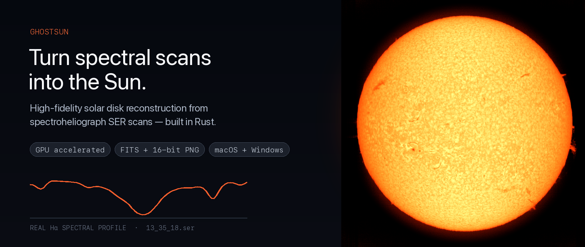
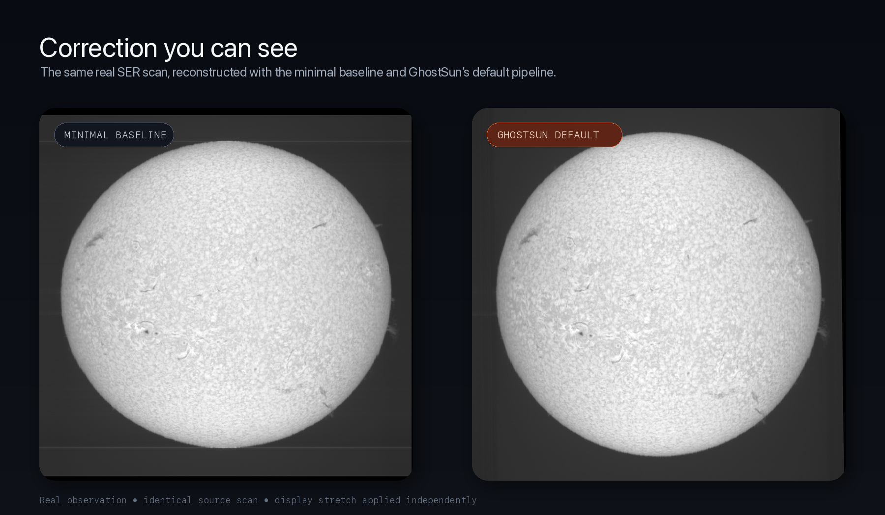
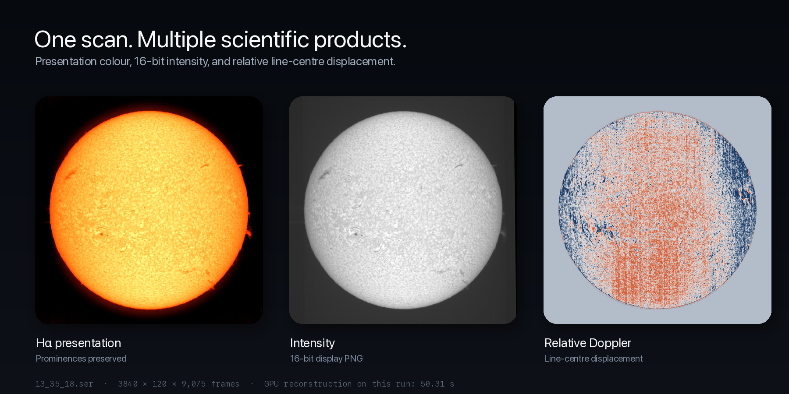
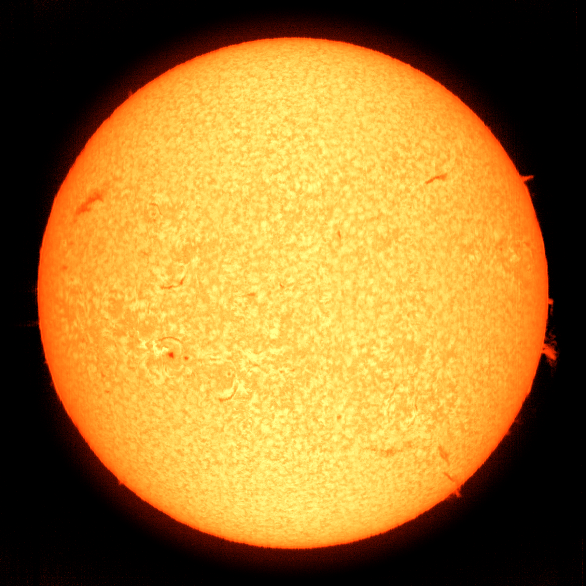

# GhostSun

<p align="center">
  
</p>

GhostSun reconstructs solar disks from spectroheliograph (Sol'Ex / SHG) SER
scans. It is a native Rust workspace containing a command-line program, a
shared reconstruction library, and a desktop viewer for Windows 11 and macOS.

The project reimplements and extends ideas used by
[INTI](https://github.com/Vdesnoux/inti). Its quality measurements use a
deterministic, physically motivated synthetic scan generator with known ground
truth. Synthetic results are useful regression evidence; they are not a
substitute for validation across independent real observations.

## Real-scan reconstruction

The images below were produced from the same real Hα observation: a
3840 × 120 pixel SER scan containing 9,075 frames. The source scan is not
included in the repository.

<p align="center">
  
</p>

<p align="center">
  
</p>

<details>
<summary>View the full-resolution Hα presentation</summary>

<p align="center">
  
</p>

</details>

## Reproducible results

The current default synthetic case is 900 frames with seed 42, a 255 px solar
radius, 0.62 px/frame sampling, 2° tilt, 0.35 px slit-direction jitter, photon
and read noise, transparency variation, and detector-row nonuniformity.
Metrics register each reconstruction to the ground truth before scoring.

| implementation | disk PSNR | disk SSIM | limb PSNR | fitted limb σ |
|---|---:|---:|---:|---:|
| GhostSun minimal baseline | 31.56 dB | 0.9174 | 20.55 dB | 1.93 px |
| **GhostSun default** | **35.47 dB** | **0.9790** | **28.71 dB** | **1.17 px** |

These numbers were regenerated from the current tree with:

```sh
cargo run --release --locked --package ghostsun -- bench --dir testdata
```

The minimal baseline is an internal GhostSun comparison path. It retains
simple integer line geometry and staged bilinear geometry, but its spectral
kernel is GhostSun's independently derived, noise-adaptive local-polynomial
estimator. It is neither INTI code nor an exact emulation of the upstream
application. Use `--ablations`, `--sweep name=v1,v2,...`, or
`--json ledger.jsonl` for more experiments.

On this same seed-42 scan, the superseded fixed-coefficient extractor scored
29.75 dB PSNR, 0.8528 SSIM, 16.98 dB at the limb, and a 3.17 px fitted limb
width. The new kernel therefore improves all four measures. On the clean
ceiling scan it also improves PSNR from 38.12 to 38.21 dB and flatness error
from 0.61% to 0.33%, guarding against a noise-only smoothing win.

The GPU check also contains a column-pattern regression. On its deterministic
test image, the default kernel reduced mixed gain/bias stripe RMSE from 101.47
to 56.30 (44.5%) while the per-scan evidence gate left the clean image
bit-for-bit unchanged. This is a synthetic unit scenario, not a promised
percentage for every instrument:

```sh
cargo run --release --locked --package ghostsun -- gpucheck
```

No wall-clock claim is made for real scans: SER dimensions, enabled stages,
storage, CPU, GPU backend, and driver have large effects. A reconstruction
prints per-stage and total timings so measurements remain attributable.

## Audited differences from INTI

The statements below were checked against upstream INTI 7.0.3, commit
`063db29449df90d70db6673a47bfd326b6446c18` dated 2025-10-27. INTI evolves, so
the comparison is deliberately scoped to that reconstruction path.

1. **Working precision.** The audited INTI path stores extracted disks as
   `uint16` and converts back to `uint16` after its low-frequency flat,
   circularisation, and optional rotation. GhostSun keeps the science path in
   `f32`; its FITS output is float, while PNG export is quantized for display.

2. **Geometric resampling.** INTI applies tilt with
   `map_coordinates(..., order=1)`, X circularisation with
   `zoom(..., order=1)`, and optional P-angle rotation with
   `cv2.INTER_LINEAR`. GhostSun composes slit shear, anisotropic scale,
   rotation, and flips into one inverse map sampled once with Lanczos-3.

3. **Spectral-line centre.** INTI 7.0.3 sets `nogauss = True` in the active
   line-geometry path, so its robust polynomial is fitted to integer
   per-row `argmin` positions. A Gaussian sub-pixel helper exists but that
   branch is not selected. GhostSun uses sub-pixel inverted-Gaussian fitting
   followed by a depth-weighted Tukey-IRLS polynomial.

4. **Core extraction.** INTI samples each row with Catmull-Rom interpolation
   and combines seven half-pixel samples using
   `[-2, 3, 6, 7, 6, 3, -2] / 21`. GhostSun's basic extractor uses
   prefiltered cubic B-splines; the default profile extractor instead estimates
   the local absorption-line centre and depth. GhostSun's minimal baseline
   derives quadratic and quartic weighted-least-squares kernels from their
   polynomial models, then blends their estimates according to measured
   row noise. It contains neither INTI's fixed coefficients nor its
   Catmull-Rom/`uint16` extraction path. A Gaussian spectral window is optional
   in basic mode (`--window-sigma`).

5. **Scan-time disturbances.** No explicit per-frame seeing-jitter solver or
   scan-time transparency model was found in the audited INTI reconstruction
   path. Its older discrete bad-line block is disabled (`flag_noline = True`).
   GhostSun separately estimates fast slit-direction jitter, slow chord drift,
   scan-direction registration, continuum-referenced transparency, and burst
   columns.

6. **Detector-row nonuniformity.** INTI does have an enabled low-frequency
   correction: it forms a per-row disk statistic and divides by two
   Savitzky-Golay trends. GhostSun uses robust quadratic LOESS with Tukey
   reweighting and dead-banding to reduce bias from active solar structure.

7. **Limb geometry.** INTI filters detected side-limb points against a
   degree-six polynomial and then replaces each side with samples of that
   polynomial before least-squares ellipse fitting. GhostSun retains measured
   sub-pixel gradient-centroid points, fits an ellipse in RANSAC, and refines it
   with Tukey IRLS on Sampson distances. INTI 7.0.3 does use an ellipse fit;
   older wording in this README that implied otherwise was incorrect.

8. **Physical output model.** GhostSun converts the fitted conic to the scan
   model of a circular Sun observed with X-scale error and slit shear. The one
   output warp inverts that model directly.

## Reconstruction pipeline

Default processing includes:

- constrained profile-model extraction at the local line centre, with
  residual-PCA denoising and a B-spline fallback for weak absorption or
  off-disk emission;
- telluric-referenced flexure and slit-velocity estimation when suitable Hα
  telluric anchors are present, with a solar-line flexure fallback;
- continuum-referenced scan transparency correction;
- continuum-anchored slit-direction motion solved before profile fitting and
  sampled sub-pixel inside the extraction kernel, plus scan-direction
  registration and temporal burst repair;
- robust detector-row nonuniformity correction and temporal NLM;
- RANSAC/IRLS ellipse estimation and one footprint-aware Lanczos-3 warp; and
- float FITS plus 16-bit linear/display PNG output.

The GPU residual column-correction stage follows those explicit corrections.
It assigns one workgroup per acquisition column to fit multiplicative gain,
additive bias, scan/slit displacement, and separate scan-axis/slit-axis blur
against near and wider temporal predictions. It corrects the original samples
rather than replacing them with neighbour columns, preserving each column's
fine detail. The model stays in native
acquisition coordinates, so fitted ellipse shear and requested image rotation
can make the corrected slit direction appear diagonal without requiring
another resampling. The processing log reports that final-view angle. Evidence
gates are recomputed for every SER, the desktop app offers an instant
before/after view, and a 0–1 strength control can be changed before reprocessing
(`--tune column_demix_strength=0.5` on the CLI; zero disables the stage).
Pre-extraction motion has a separate 0–1.5 control
(`--tune motion_strength=1.0`); zero disables it, one applies the measured
trajectory, and values above one are deliberately more aggressive.

The desktop app can also establish an absolute solar pose from a timestamped
SER. **Orient from GONG** reads the SER's UTC acquisition time, downloads and
caches the nearest full-resolution GONG H-alpha frame, then registers
chromospheric features while searching both image parities and all rotations.
Only a confident match is applied; weak, rotation-ambiguous, or
parity-ambiguous results leave the image unchanged. The resulting convention
is solar north at the top and the east limb at the left, matching the
calibrated GONG product. Grayscale, before/after column-state, H-alpha colour,
and Doppler views receive the same transform. Because the reference is matched
after reconstruction, this optional presentation correction performs one
additional Lanczos-3 resample.

Optional processing includes:

- relative line-centre displacement maps and wing-difference Dopplergrams
  (`--velocity`);
- multi-scan registration, stiff optical-flow evolution compensation,
  quadratic gain surfaces, and sharpness-weighted robust stacking (`stack`);
- limb-estimated anisotropic PSF deconvolution using Richardson-Lucy with TV
  damping (`--deconv`), automatically skipped below its blur threshold;
- generalized-Anscombe, undecimated B3-wavelet denoising with estimated photon
  and read noise (`--denoise`); and
- block-coordinate correction refinement (`--map-iterations N`).

Velocity FITS values are spectral line-centre displacements in pixels. They are
relative Doppler observables, not an absolute line-of-sight velocity calibration
in km/s; physical calibration requires the instrument dispersion and wavelength
reference.

The synthetic harness can independently add Doppler fields, scan-direction
jitter, flexure, telluric lines, seeing PSF/slit integration, low exposure,
seeing bursts, and sequential evolving scans.

## GPU and platform support

The same WGSL compute kernels run through `wgpu`: Metal on macOS and Direct3D
12 or Vulkan on Windows. Profile extraction, temporal NLM, and the composed
warp have CPU fallbacks. Residual column-state demixing is GPU-only and is
skipped when no compatible compute adapter is available.

The `Desktop builds` GitHub Actions workflow tests the workspace and publishes
packaged Windows x64, macOS Apple Silicon, and macOS Intel artifacts. Pushing a
tag beginning with `v` also creates or updates a GitHub Release containing all
three ZIPs and their SHA-256 checksums. Tagged macOS packages are Developer ID
signed and notarized, with the ToupTek and ZWO camera SDKs bundled inside the
app.

## Usage

### Desktop app

Open or drag a `.ser`, `.fits`, `.fit`, or `.png` file into GhostSun. SER scans
wait for the user to review the pipeline controls and click **Process**; FITS
and PNG files open in view-only mode. The viewer provides grayscale, Hα colour,
relative Doppler, and live before/after column-correction views when those
products exist. **Orient from GONG** additionally requires network access and a
valid UTC timestamp in the source SER; downloaded public reference JPEGs are
cached in the operating system's temporary directory.

On macOS:

```sh
cargo run --release --locked --package ghostsun-app
```

Packaged builds are available from the `Desktop builds` workflow or a tagged
GitHub Release. See the [macOS](docs/macos.md) and
[Windows](docs/windows.md) build and usage guides.

### Command line

```sh
# Reconstruct a real scan: float FITS + 16-bit linear/display PNG
ghostsun recon scan.ser --out-dir out

# Also write relative line-centre and wing-difference Doppler products
ghostsun recon scan.ser --out-dir out --velocity

# Minimal internal pipeline for controlled comparisons
ghostsun recon scan.ser --out-dir out --baseline --name minimal

# Reconstruct a wavelength offset in pixels from the line core
ghostsun recon scan.ser --shift 15

# Tune or disable residual column-state correction
ghostsun recon scan.ser --tune column_demix_strength=0.5
ghostsun recon scan.ser --tune column_demix_strength=0

# Colourized presentation with a black background and preserved prominences
ghostsun colorize out/recon.fits
ghostsun recon scan.ser --colorize

# Synthetic data and registered evaluation
ghostsun synth --out-dir testdata --jitter 1.0 --tilt 4
ghostsun eval out/recon_linear.png testdata/ground_truth.png
ghostsun bench --dir testdata --ablations
```

Reconstruction switches include `--no-jitter`, `--no-transparency`,
`--no-transversalium`, `--no-profile`, `--no-filtered-warp`, `--no-xreg`,
`--no-burst-repair`, `--no-nlm`, `--no-gpu`, `--deconv`, `--denoise`,
`--window-sigma S`, `--rotation P`, `--flip-x`, `--flip-y`, and general
`--tune name=value,...` overrides.

## Workspace layout

- `crates/ghostsun-core/src/ser.rs` — memory-mapped SER v3 reader/writer
- `crates/ghostsun-core/src/linefit.rs` — sub-pixel line geometry
- `crates/ghostsun-core/src/extract.rs` — profile sampling and adaptive local-polynomial kernel
- `crates/ghostsun-core/src/profile.rs` — profile extraction, flexure, velocity
- `crates/ghostsun-core/src/jitter.rs` — slit/scan registration and slow drift
- `crates/ghostsun-core/src/flatfield.rs` — transparency and row nonuniformity
- `crates/ghostsun-core/src/quality.rs` — burst repair and temporal NLM
- `crates/ghostsun-core/src/limb.rs`, `ellipse.rs` — limb and robust conic fit
- `crates/ghostsun-core/src/warp.rs` — composed CPU warp and baseline warps
- `crates/ghostsun-core/src/gpu.rs`, `gpu_extract.rs` — WGSL compute paths
- `crates/ghostsun-core/src/stack.rs` — multi-scan registration and stacking
- `crates/ghostsun-core/src/deconv.rs`, `denoise.rs` — optional restoration
- `crates/ghostsun-core/src/synth.rs`, `metrics.rs` — synthetic data and scoring
- `crates/ghostsun-app` — native desktop viewer
- `crates/ghostsun-cli` — `ghostsun` command-line program

GhostSun is licensed under the MIT License.
